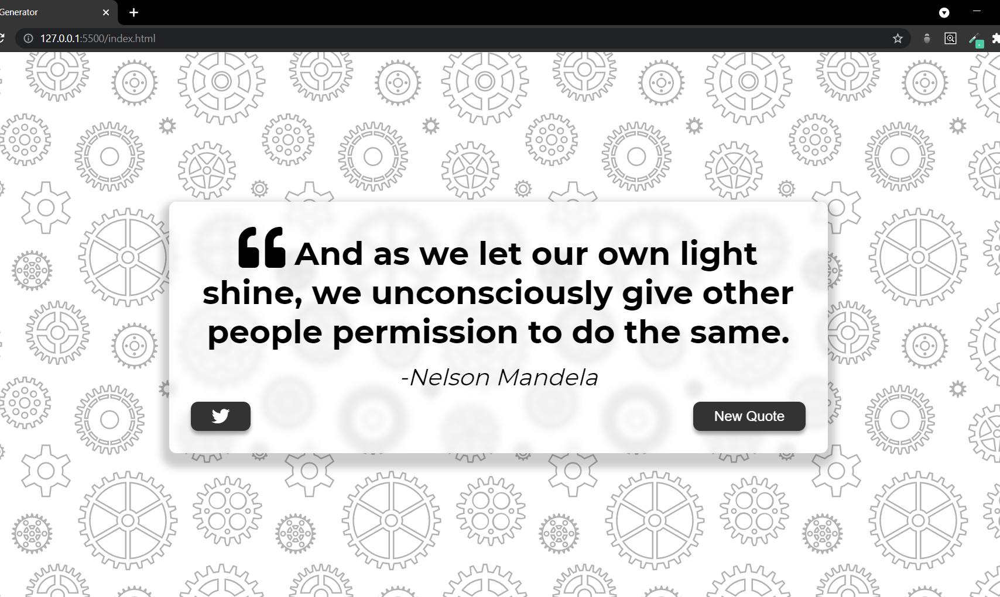
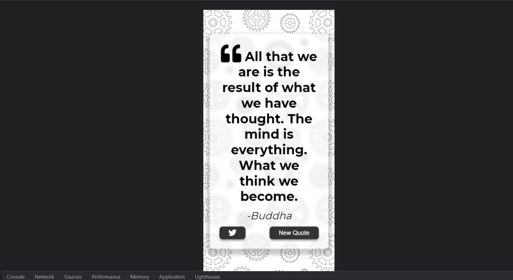

# Quotes Generator

This quote generator website is built using "**HTML**" , "**CSS**" and "**JAVASCRIPT**".

And all the quotes on the site are **Dynamically** generated using **Asynchronous Fetch()** request which fetches a random quote from a "*Rest Quotes API*".

The Site contains Two buttons 
1. A "*New Quote Button*" which when pressed Randomly selects a new quotes from the fetched data from the api and populates the DOM.
2. A "*Twitter Button*" which takes you to twitter on new tab, that if when Logged In allows you to tweet the quote which was generated.

&nbsp

## Screenshot of the Site

&nbsp

1. **Normal View**

&nbsp

&nbsp

2. **Responsive View**

&nbsp

